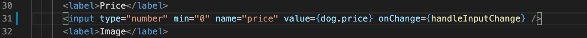
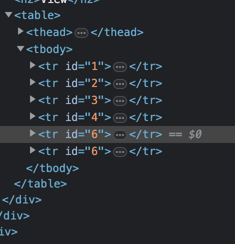
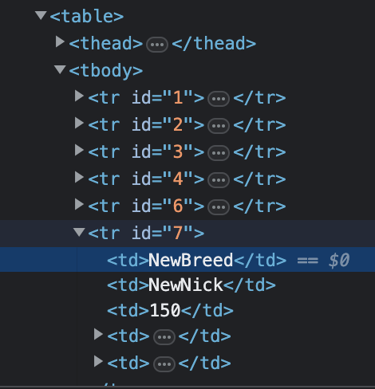

# TODO APP

This is the solution to the QA Tech challenge

## How to run the application
In "todo-app" folder:
1. Run command `npm install`
2. Run command `npm start`

If you see such error:
```
Error: error:0308010C:digital envelope routines::unsupported
    at new Hash (node:internal/crypto/hash:71:19)
    at Object.createHash (node:crypto:133:10)
    at module.exports (/Users/user/repo/todo-app/node_modules/webpack/lib/util/createHash.js:135:53)
    at NormalModule._initBuildHash (/Users/user/repo/todo-app/node_modules/webpack/lib/NormalModule.js:417:16)
    at /Users/user/repo/todo-app/node_modules/webpack/lib/NormalModule.js:452:10
    at /Users/user/repo/todo-app/node_modules/webpack/lib/NormalModule.js:323:13
    at /Users/user/repo/todo-app/node_modules/loader-runner/lib/LoaderRunner.js:367:11
    at /Users/user/repo/todo-app/node_modules/loader-runner/lib/LoaderRunner.js:233:18
    at context.callback (/Users/user/repo/todo-app/node_modules/loader-runner/lib/LoaderRunner.js:111:13)
    at /Users/user/repo/todo-app/node_modules/babel-loader/lib/index.js:59:103 {
  opensslErrorStack: [ 'error:03000086:digital envelope routines::initialization error' ],
  library: 'digital envelope routines',
  reason: 'unsupported',
  code: 'ERR_OSSL_EVP_UNSUPPORTED'
```
In such case you need to run command `export NODE_OPTIONS=--openssl-legacy-provider` before you start the application.

## How to run Cypress tests

In `todo-app` folder: 
1. Run command `npx cypress open`
2. In the cypress window choose `tests.feature`

## Most important changes

### I have changed the code in EditDogForm.js to set min=0. Since then, price can not be negative anymore.


### Added condition to the Edit form, to make sure that user can not set empty values during Edit.


### Added argument `id` to element `<tr>` + added new column: ID


### Updated the function for ID generation.

Previous implementation allowed duplicate IDs e.g. in case if existing dog with id 5 was deleted and then another was added, it could get `id` 6 instead of 7.

Now it's:
```
	const addDog = dog => {
		dog.id = dogs[dogs.length - 1].id + 1
		setDogs([ ...dogs, dog ])
	}
```
See the screenshots.

Here are the duplicate IDs (previous implementation):



Here are the correct IDs (new implementation):



